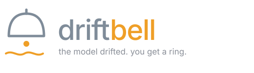

<div align="center">



**An ML drift watchman that investigates before it acts, and asks you first.**

[](LICENSE)
[](https://github.com/langchain-ai/langgraph)
[](https://n8n.io)
[](https://python.org)
[](#cost)

</div>

---

Production models fail quietly. The data shifts, accuracy slides, and nobody
notices for weeks. Driftbell watches for that shift, works out *why* it
happened, and rings you before anything is changed.

**n8n** runs the plumbing: schedules, integrations, credentials, retries, and
the approval you tap on your phone. **LangGraph** runs the thinking: a cyclic
agent that gathers evidence, critiques its own conclusion, and freezes mid-graph
until a human signs off.

```
   drift detected  →  agent investigates  →  proposal  →  🔔 you approve  →  retrain
        n8n              LangGraph          LangGraph        n8n              n8n
```

### Why two layers

A canvas can't loop and an agent shouldn't hold your credentials. n8n owns the
macro plane: triggers, integrations, audit trail, human approval. LangGraph owns
the micro plane: cycles, conditional edges, checkpointed state. The interesting
part is where they meet. n8n's `Wait` node pairs with LangGraph's `interrupt()`,
so an approval that arrives six hours later still lands on a live graph.

Kill the service while a decision is pending, restart it, and the thread resumes
exactly where it stopped.

---

<!--
Repo settings that decide where this ranks in GitHub search:

  Name          driftbell            (lowercase, exact, 0 competing repos)
  Description   ML drift watchman built on n8n + LangGraph. Investigates
                model drift, proposes a fix, waits for human approval.
  Topics        langgraph  n8n  mlops  drift-detection  human-in-the-loop
                ai-agents  llm  model-monitoring  fastapi  automation

Also reserve the name on PyPI and npm so nobody outranks you later.
-->
