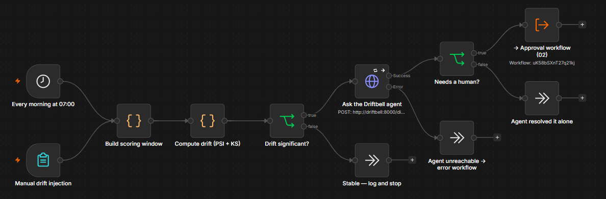
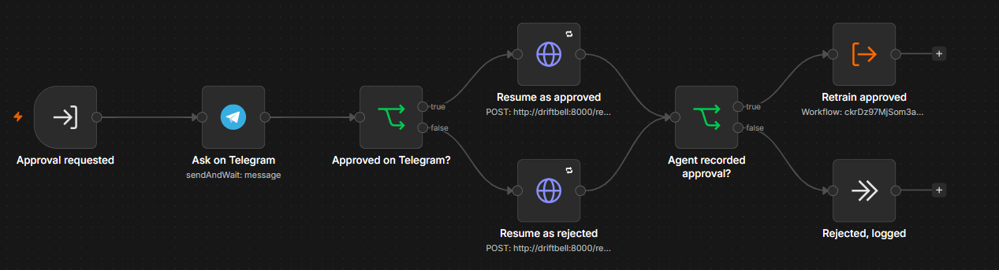
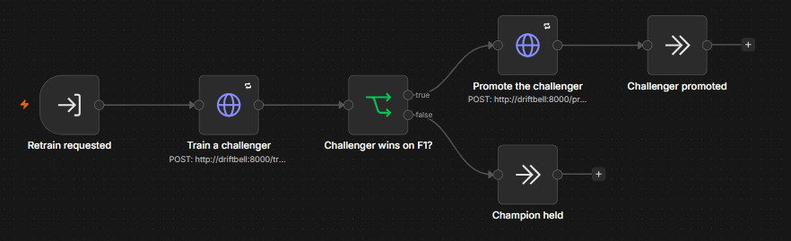
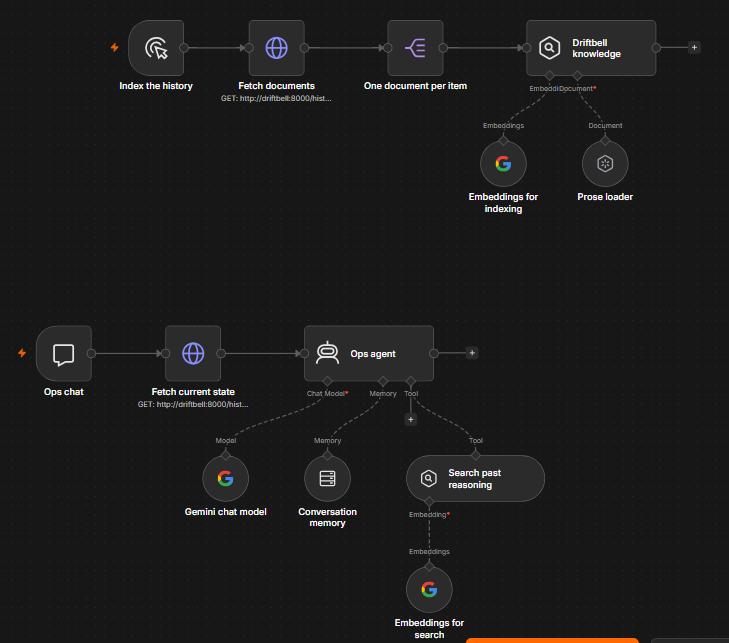
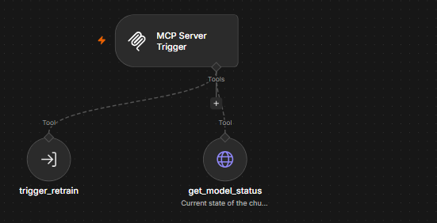
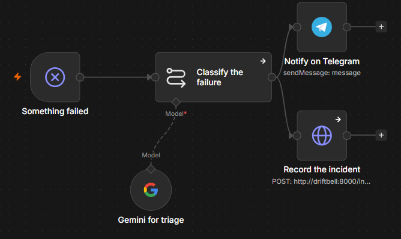

# The six workflows

The exported JSON in this directory is the source of truth. Import it, don't
hand-edit it — n8n rewrites node ids and connection maps on save, and a
hand-patched export usually imports as something subtly different.

```bash
docker compose up -d          # n8n on :5678, agent on :8000
docker compose logs -f driftbell
```

Open <http://localhost:5678>, create the local owner account, then
**Workflows → Import from File** for each file here.

n8n reaches the agent at `http://driftbell:8000`, which is the container name.
Inside the n8n container, `localhost` is n8n itself.

**Publish 01, 02, 03 and 06.** 04 and 05 are a chat trigger and an MCP trigger —
publish them only when you want that surface live.

---

## 01 — Ingest & monitor

The scheduled half of Driftbell. It pulls a scoring window, measures how far it
has moved from the training distribution, and hands anything suspicious to the
LangGraph agent.



**Two triggers into one pipeline.** Schedule for production, form for demos.
Worth pointing out in an interview: it shows you thought about how the thing gets
demonstrated, not just how it runs.

**Compute drift (PSI + KS)** is plain arithmetic in a JavaScript Code node. n8n
2.x retired the Pyodide runtime, and the image ships no Python binary, so a
Python Code node fails outright — and Code nodes cannot import packages either
way. There is no scipy here and nothing to install. The KS statistic this
produces matches `scipy.stats.ks_2samp`; the p-value uses the asymptotic
approximation, which agrees to the same order of magnitude.

Rule of thumb for PSI: under 0.1 stable, 0.1–0.2 minor shift, above 0.2 worth
investigating. The threshold lives in the IF node so you can tune it without
touching code.

**Ask the Driftbell agent** has `retryOnFail` with 3 tries and a separate error
output. A cold-start LLM call can take 30 seconds and a free tier can rate-limit
you; retrying is not optional here. The error branch routes to workflow 06 rather
than failing silently.

**Needs a human?** branches on the `status` the agent returns. `IGNORE` verdicts
come back as `completed` and never interrupt you. That is deliberate, so the
approval channel stays credible.

### Demo it

Open the **Manual drift injection** form node, copy its Test URL, and submit:

| drift_magnitude | What happens |
|---|---|
| `0` | PSI ≈ 0.01 → stable branch, nothing escalates |
| `4` | PSI ≈ 0.11 → still under threshold, logged as moderate |
| `12` | PSI ≈ 0.70 → agent invoked, proposal comes back, waits for you |

Those numbers are from actually running the node, not estimates. Being able to
dial drift up and down on demand is what makes this demo work in a five-minute
interview slot.

---

## 02 — Approval loop

The seam. This is the workflow the whole project exists to demonstrate.



**Ask on Telegram** is a `sendAndWait` node. n8n parks the execution there — not
polling, not looping, just stopped — until someone taps a button. The execution
can sit there for hours; n8n has already written it to disk.

Whichever branch that produces calls `POST /resume` with the `thread_id` carried
through from workflow 01. On the agent's side that resumes a graph frozen at
`interrupt()`. Neither side knows or cares how long the other took, and the only
thing joining them is that string.

**Agent recorded approval?** checks what came back before invoking workflow 03.
An approval the agent did not record is not an approval, and retraining on the
strength of a Telegram tap alone would trust the wrong layer.

Telegram will not accept an inline keyboard button pointing at `localhost` — it
validates the URL when the message is sent. Without a public HTTPS address the
approval message cannot be delivered at all. See the tunnel section in the main
README.

---

## 03 — Retrain & evaluate

Called as a sub-workflow by 02, never directly by a human.



**Train a challenger** calls `POST /train`, which fits a model and records the
run but deliberately never promotes. It returns champion and challenger metrics
side by side.

**Challenger wins on F1?** is the point of the whole workflow. The comparison
happens here, on the canvas, in an IF node you can read — not inside the agent.
Only if it passes does `POST /promote` move the champion. An agent that could
promote its own model would be an agent that can change production unsupervised.

The gate uses F1 alone, which is a real limitation: a promotion can raise F1 and
drop accuracy without recording that it made the trade. Noted in the main README.

---

## 04 — Ops agent

The chatbot. Two independent branches in one workflow.



**The top branch indexes.** `GET /history/documents` returns the agent's own
recorded rationales and incident descriptions as prose, split one document per
item, embedded with Gemini and loaded into the vector store.

**The bottom branch answers.** The agent gets two sources deliberately kept
apart: `GET /history` for exact numbers, because a figure belongs in a query
result rather than an embedding, and **Search past reasoning** over the vector
store for *why* something happened. Ask "why was churn_clf retrained?" and it
quotes what the agent actually concluded.

The vector store is in-memory, so an n8n restart empties it and retrieval
returns nothing — with no error. Re-run the indexing branch after a restart.

---

## 05 — MCP server

Exposes Driftbell to any MCP client — Claude Desktop, or anything else that
speaks the protocol.



Two tools, and the choice of which two is the interesting part.
`get_model_status` reads. `trigger_retrain` invokes the same workflow a human
approval invokes — so an external client gets exactly the reach a human has, and
no more. Bearer-authenticated.

---

## 06 — Error handler

Set as the error workflow on 01–05. It points at nothing itself: an error
handler that reported its own failures to itself would loop.



**Notify on Telegram and Record the incident are siblings, not a chain.** That
is the whole design. Incidents live in the agent's database, so if the agent is
what died, the recorder fails — and putting the alert downstream of it would
mean the outage that matters most is the one that pages nobody.

**Classify the failure** asks Gemini to triage, but it cannot block the alert
either. Triage is a nice-to-have on a path where the only thing that must always
work is telling you something broke.

**The loop worth noticing:** a failure here becomes a row in `incidents`, and
`get_pipeline_incidents` is one of the agent's four tools. Its system prompt says
a drift alert coinciding with an ingestion incident is usually a bug, not drift.
So a pipeline failure today makes tomorrow's diagnosis more sceptical.
